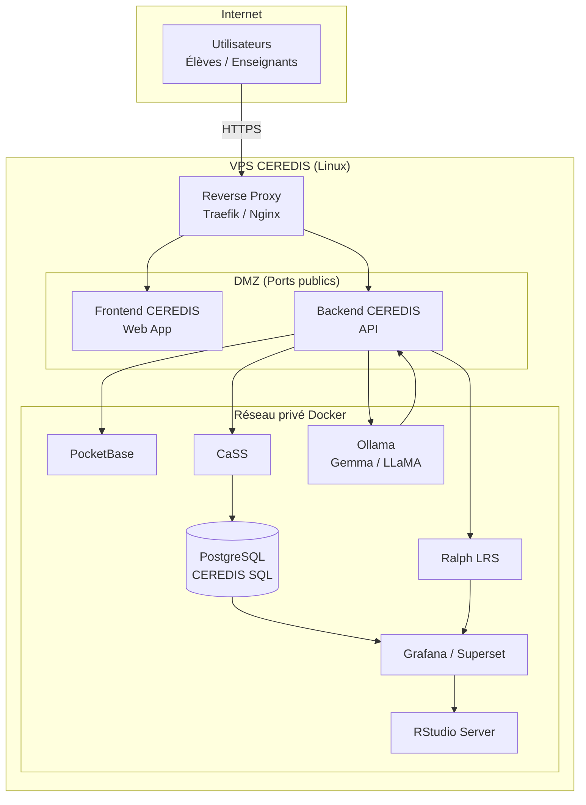
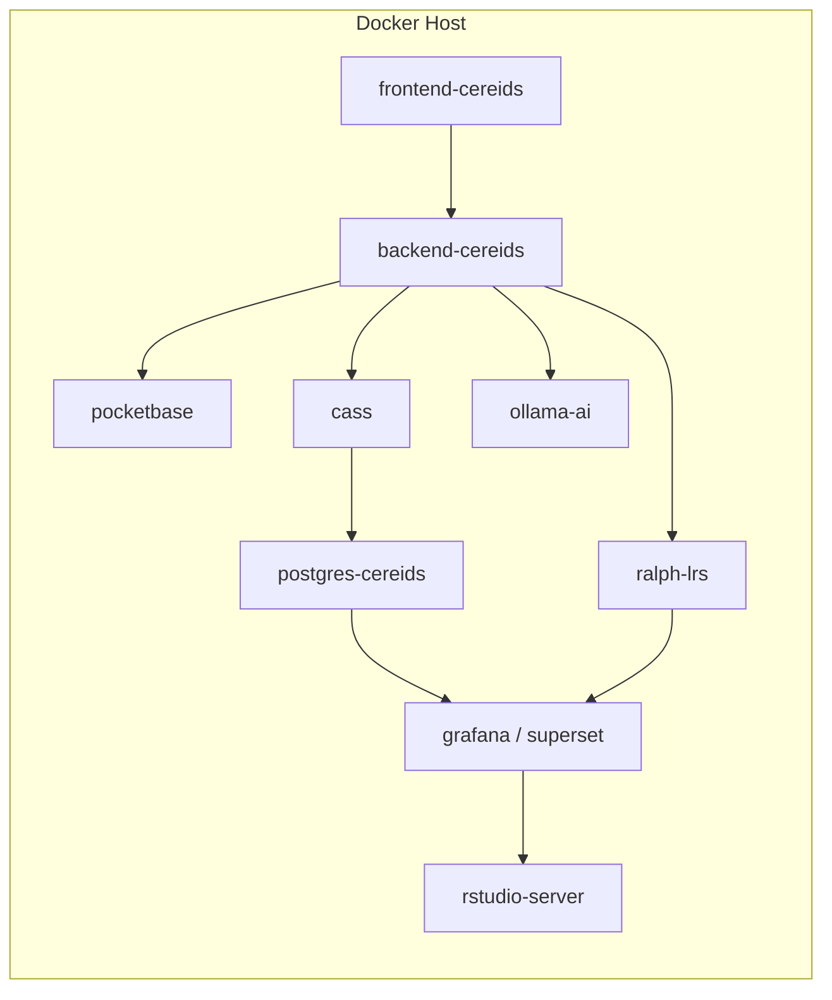

Voici un **diagramme d’infrastructure CEREDIS** formalisé **au niveau DevOps / déploiement**, couvrant :

* **VPS / réseau**
* **conteneurs Docker**
* **flux inter-services**
* **exigences de sécurité et d’isolement**

Il est structuré selon une logique **réaliste de mise en production** (un ou plusieurs VPS), et fourni en **Mermaid** pour intégration directe dans votre documentation technique.

---

# CEREDIS — Diagramme d’infrastructure

## Docker / VPS / Réseau

---

## 1. Hypothèses d’infrastructure (explicites)

* Déploiement sur **VPS Linux (Ubuntu 22.04/24.04)**
* Orchestration via **Docker Compose** (phase pilote)
* Reverse proxy unique (**Traefik ou Nginx**)
* Réseau privé Docker pour les services internes
* Accès public **strictement contrôlé**

---

## 2. Vue globale — Infrastructure réseau (VPS)



---

## 3. Lecture réseau (fondamentale)

### Accès public (Internet)

* **Frontend CEREDIS**
* **Backend API**

👉 Tout le reste est **strictement non exposé**.

### Réseau privé Docker

* CaSS
* PocketBase
* PostgreSQL (calculs CEREDIS)
* Ralph (LRS)
* Grafana / Superset
* RStudio Server
* IA (Ollama)

---

## 4. Vue Docker — Conteneurs & responsabilités



---

## 5. Ports & exposition (recommandations)

| Service        | Port      | Exposé publiquement |
| -------------- | --------- | ------------------- |
| Reverse Proxy  | 443       | ✅                   |
| Frontend       | 3000 / 80 | ✅                   |
| Backend API    | 8080      | ✅                   |
| PocketBase     | 8090      | ❌                   |
| CaSS           | 80 / 8080 | ❌                   |
| PostgreSQL     | 5432      | ❌                   |
| Ralph          | 8100      | ❌                   |
| Grafana        | 3000      | ❌                   |
| Superset       | 8088      | ❌                   |
| RStudio Server | 8787      | ❌                   |
| Ollama         | 11434     | ❌                   |

👉 Accès aux outils internes **uniquement via VPN ou SSH tunnel**.

---

## 6. Séparation logique des données (clé sécurité)

| Type de données       | Stockage           |
| --------------------- | ------------------ |
| Données pédagogiques  | PocketBase         |
| Preuves & compétences | CaSS               |
| Scores & agrégations  | PostgreSQL         |
| Traces d’usage        | Ralph              |
| Analytics             | Grafana / Superset |
| Données recherche     | Exports CSV        |
| IA (contextes)        | Mémoire volatile   |

---

## 7. Flux critiques (rappel fonctionnel)

### 7.1. Évaluation

```
Frontend → API → CaSS → PostgreSQL
```

### 7.2. Learning Analytics

```
CaSS / Ralph → Grafana / Superset
```

### 7.3. Recherche

```
Grafana / Superset → RStudio
```

### 7.4. IA adaptative

```
CaSS → Ollama → API → Frontend
```

---

## 8. Sécurité & conformité (points non négociables)

### Réseau

* aucun accès direct DB depuis Internet
* segmentation DMZ / privé
* certificats TLS (Let’s Encrypt)

### Données

* anonymisation pour RStudio
* pas de scores bruts exposés aux élèves
* journalisation des recalculs CEREDIS

### IA

* pas d’accès direct aux preuves brutes
* pas d’écriture en base évaluative
* pas de décision CECRL

---

## 9. Scalabilité (phase 2)

Cette architecture permet facilement :

* séparation **multi-VPS** :

  * VPS 1 : App + API
  * VPS 2 : CaSS + DB
  * VPS 3 : Analytics + RStudio
  * VPS 4 : IA
* passage à **Kubernetes** si nécessaire
* mutualisation inter-projets CEREDIS

---

## 10. Ce que ce diagramme apporte

* une **vision DevOps claire**,
* une base pour :

  * Docker Compose,
  * scripts d’installation,
  * audits sécurité,
* une **architecture crédible et institutionnelle**.

---

