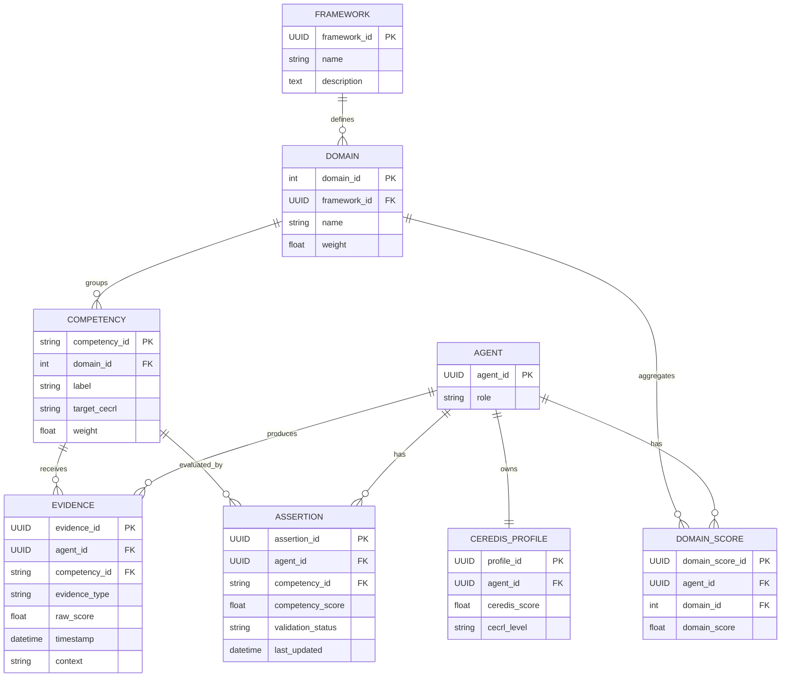

Voici un **diagramme UML / ER formalisé**, **orienté développeurs**, qui traduit **sans ambiguïté** l’architecture CEREDIS telle que nous l’avons définie (CaSS + échelle CEREDIS).
Il est fourni **à deux niveaux** :

1. **Diagramme conceptuel UML (classes & relations)**
2. **Diagramme ER logique (base de données / API)**

Puis je termine par des **règles d’implémentation critiques** pour éviter toute dérive.

---

# 1. Diagramme UML — Vue conceptuelle (classes)

Ce diagramme décrit les **objets métiers** et leurs relations.

```mermaid
classDiagram

class Agent {
  +agentId : UUID
  +role : enum {learner, teacher, researcher}
}

class CompetencyFramework {
  +frameworkId : UUID
  +name : string
  +description : text
}

class Domain {
  +domainId : int
  +name : string
  +weight : float
}

class Competency {
  +competencyId : string  // ex: "5.3"
  +label : string
  +targetCECRL : enum {A2, B1, B2, C1}
  +weight : float
}

class Evidence {
  +evidenceId : UUID
  +evidenceType : enum {P1, P2, P3, P4}
  +rawScore : float  // 0–100
  +timestamp : datetime
  +context : string
}

class Assertion {
  +assertionId : UUID
  +competencyScore : float  // 0–100
  +validationStatus : enum {incomplet, partiel, acquis}
  +lastUpdated : datetime
}

class DomainScore {
  +domainScoreId : UUID
  +score : float  // 0–100
}

class CEREDISProfile {
  +profileId : UUID
  +ceredisScore : float  // 0–600
  +cecrlLevel : enum {A2, B1, B2, C1}
}

Agent "1" --> "many" Evidence : produces
Evidence "many" --> "1" Competency : targets
Agent "1" --> "many" Assertion : has
Competency "1" --> "many" Assertion : evaluatedBy
CompetencyFramework "1" --> "many" Domain
Domain "1" --> "many" Competency
Assertion "many" --> "1" DomainScore : aggregatesTo
DomainScore "many" --> "1" CEREDISProfile
CEREDISProfile "1" --> "1" Agent
```

---

## Lecture développeur (UML)

* **Evidence** = donnée primaire (input)
* **Assertion** = résultat calculé par compétence
* **DomainScore** = agrégation logique (peut être vue matérialisée ou calculée)
* **CEREDISProfile** = vue synthétique par apprenant
* **CECRL_Level** = attribut **dérivé**, jamais saisi

---

# 2. Diagramme ER — Vue logique (base de données / API)

Ce diagramme correspond à une implémentation **relationnelle** ou **API orientée ressources**.



---

## Lecture développeur (ER)

* **EVIDENCE** est la seule table alimentée manuellement
* **ASSERTION**, **DOMAIN_SCORE**, **CEREDIS_PROFILE** sont :

  * calculées,
  * recalculables à la volée,
  * ou matérialisées par batch / trigger / service.

---

# 3. Flux de calcul (rappel fonctionnel)

```
EVIDENCE (rawScore, type)
        ↓
ASSERTION.competencyScore
        ↓
DOMAIN_SCORE.domainScore
        ↓
CEREDIS_PROFILE.ceredisScore
        ↓
CEREDIS_PROFILE.cecrlLevel
```

---

# 4. Règles d’implémentation critiques (à respecter absolument)

### Règle 1 — Séparation données / calcul

* **EVIDENCE** = données sources
* Tout le reste = **données dérivées**

👉 Ne jamais saisir manuellement :

* competencyScore
* domainScore
* ceredisScore
* cecrlLevel

---

### Règle 2 — Auditabilité

Chaque score doit être :

* explicable par descente :
  `CECRL → CEREDIS → Domain → Competency → Evidence`
* recalculable à l’identique

---

### Règle 3 — Évolutivité

Ce modèle permet :

* ajout d’un **C2**,
* ajout d’un **Domaine 6**,
* ajout de nouveaux **types de preuves**,
  sans refonte structurelle.

---

## 5. Ce que ce diagramme vous apporte

* un **langage commun** chercheurs / développeurs,
* une base solide pour :

  * API,
  * exports statistiques,
  * tableaux de bord,
* une architecture **au niveau des systèmes d’évaluation certifiants**.

---

